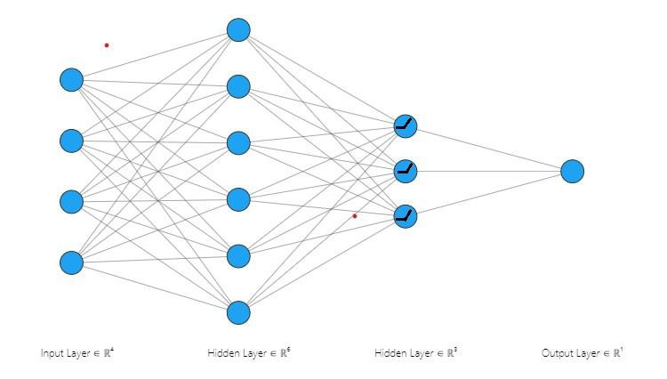
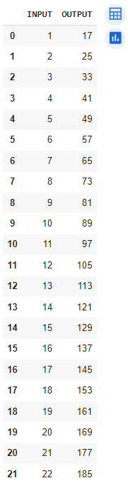
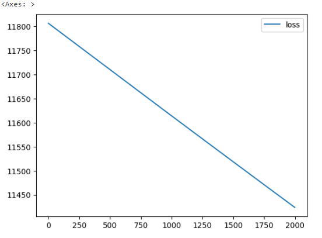
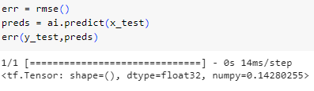

# Developing a Neural Network Regression Model

## AIM

To develop a neural network regression model for the given dataset.

## THEORY

Neural networks consist of simple input/output units called neurons. In this article, we will see how
neural networks can be applied to regression problems.
Regression helps in establishing a relationship between a dependent variable and one or more
independent variables. Although neural networks are complex and computationally expensive, they
are flexible and can dynamically pick the best type of regression, and if that is not enough, hidden
layers can be added to improve prediction.
Build your training and test set from the dataset, here we are making the neural network 3 hidden
layer with activation layer as relu and with their nodes in them. Now we will fit our dataset and then
predict the value.

## Neural Network Model



## DESIGN STEPS

### STEP 1:

Loading the dataset

### STEP 2:

Split the dataset into training and testing

### STEP 3:

Create MinMaxScalar objects ,fit the model and transform the data.

### STEP 4:

Build the Neural Network Model and compile the model.

### STEP 5:

Train the model with the training data.

### STEP 6:

Plot the performance plot

### STEP 7:

Evaluate the model with the testing data.

## PROGRAM
### Name: Sriram G
### Register Number:212222230149

## Importing Modules
```
from google.colab import auth
import gspread
from google.auth import default
import pandas as pd
from sklearn.model_selection import train_test_split
from sklearn.preprocessing import MinMaxScaler
import matplotlib.pyplot as plt
from tensorflow.keras.models import Sequential as Seq
from tensorflow.keras.layers import Dense as Den
from tensorflow.keras.metrics import RootMeanSquaredError as rmse
```
## Authenticate & Create Dataframe using Data in Sheets
```
auth.authenticate_user()
creds, _ = default()
gc = gspread.authorize(creds)
sheet = gc.open('Data1').sheet1
rows = sheet.get_all_values()
df = pd.DataFrame(rows[1:], columns=rows[0])
df = df.astype({'INPUT':'int'})
df = df.astype({'OUTPUT':'int'})
df.head(22)
```
## Assign X and Y values
```
x = df[["INPUT"]] .values
y = df[["OUTPUT"]].values
```

## Normalize the values & Split the data
```
scaler = MinMaxScaler()
scaler.fit(x)
x_n = scaler.fit_transform(x)
x_train,x_test,y_train,y_test = train_test_split(x_n,y,test_size = 0.3,random_state = 3)
```
## Create a Neural Network & Train it
```
model =Seq()
model.add(Den(4,activation='relu',input_shape=[1]))
model.add(Den(6))
model.add(Den(3,activation='relu'))
model.add(Den(1))
model.summary()
model.compile(optimizer = 'rmsprop',loss = 'mse')
model.fit(x_train,y_train,epochs=2000)
model.fit(x_train,y_train,epochs=2000)
```
## Plot the Loss
```
loss_plot = pd.DataFrame(model.history.history)
loss_plot.plot()
```
## Evaluate the model

```
err = rmse()
preds = ai.predict(x_test)
err(y_test,preds)
```
## Predict for some value

```
x_n1 = [[30]]
x_n_n = scaler.transform(x_n1)
ai.predict(x_n_n)
```


## Dataset Information


## OUTPUT

### Training Loss Vs Iteration Plot



### Test Data Root Mean Squared Error



### New Sample Data Prediction


## RESULT

Thus a neural network regression model for the given dataset is written and executed successfully.
